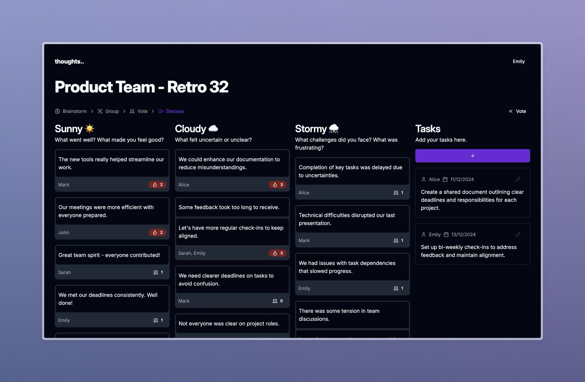

# Thoughts 💭

**Thoughts** is a simple self-hosted tool for facilitating retrospectives.

- Simple authentication, enter your name and start using the app
- Create a retrospective using one of the templates provided or
  use your own custom columns
- Add thoughts to the retrospective, only visible to you
- Group similar thoughts together
- Vote on thoughts to prioritize them
- Discuss thoughts with your team
- Add tasks to document action items

> [!NOTE]
> Thoughts has live updates so that you can ensure everyone is on the same page ⚡️



## Getting Started

The easiest ways to get started with Thoughts is to use the
standalone binary release or the docker image.

### Standalone Binary

Go to the [releases page](https://github.com/ellgreen/thoughts/releases) and download
the latest release for your platform.

```shell
./thoughts
```

### Docker Image

```shell
docker run -p 3000:3000 -v $PWD/data:/data ghcr.io/ellgreen/thoughts:latest
```

#### Want to terminate TLS in the container?

```shell
docker run -p 3000:3000 \
  -v $PWD/data:/data \
  -e THOUGHTS_TLS_CERT_PATH="/path/to/your/tls.crt" \
  -e THOUGHTS_TLS_KEY_PATH="/path/to/your/tls.key" \
  ghcr.io/ellgreen/thoughts:latest
```

### Features

#### AI

To enable AI features, you will need to set the `THOUGHTS_OPENAI_API_KEY`
environment variable.

You can follow the instructions to get an API key here:

<https://platform.openai.com/api-keys>

#### GIF Support

To enable support for gifs via Tenor, you will need to set the
`THOUGHTS_TENOR_API_KEY` environment variable.

You can follow the instructions to get an API key here:

<https://developers.google.com/tenor/guides/quickstart#setup>
